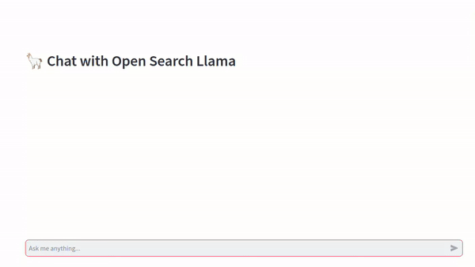

<div align="center">

# Open Search Llama 🦙

[](https://github.com/sabeeralikp/open_search_llama/stargazers)
[](https://opensource.org/licenses/MIT)
[](https://www.python.org/downloads/)
[](https://github.com/hwchase17/langchain)

### Your Personal, Private Search Assistant 🔍

<p align="center">
  
</p>

An Open Source Search Assistant powered by LangChain and Llama 3.2, providing a private alternative to SearchGPT and Perplexity.

[Features](#-features) • [Quick Start](#-quick-start) • [Installation](#-installation) • [Documentation](#-documentation) • [Contributing](#-contributing)

---
</div>

## ✨ Features

- 🏃‍♂️ **Fully Local** - Everything runs on your machine
- 🔒 **Privacy First** - Your data never leaves your control
- 🦜 **LangChain Integration** - Leveraging the power of LangChain for robust conversational search
- 🧠 **Llama 3.2 Powered** - Using state-of-the-art language models
- 🎯 **Customizable** - Easy to modify and adapt to your needs
- 📊 **Context Aware** - Maintains conversation context for better responses
- 🌐 **Multiple Deployment Options** - Run locally or in the cloud

## 🚀 Quick Start

<details>
<summary>🖥️ Running Locally (Click to expand)</summary>

### Prerequisites
- Python 3.8 or higher
- Git
- [Ollama](https://ollama.ai/)

### Quick Installation
```bash
# Clone the repo
git clone https://github.com/sabeerali/open_search_llama.git
cd open_search_llama

# Install Ollama and pull model
ollama pull llama3.2

# Set up environment (choose one):
# Using Python venv:
python -m venv venv
source venv/bin/activate  # Unix/macOS
# OR
venv\Scripts\activate     # Windows
pip install -r requirements.txt

# OR Using UV:
uv venv
source .venv/bin/activate  # Unix/macOS
# OR
.venv\Scripts\activate     # Windows
uv pip install -r requirements.txt

# Launch the application
uvicorn app:app --reload
# Copy the URL (typically http://127.0.0.1:8000)

# In a new terminal:
streamlit run streamlit_app.py
# Paste the FastAPI URL when prompted
```
</details>

<details>
<summary>☁️ Running on Colab/Kaggle (Click to expand)</summary>

1. **Create Ngrok Account**
   - Visit [ngrok.com](https://ngrok.com/)
   - Sign up & copy your auth token

2. **Setup in Colab/Kaggle**
   - Upload `notebooks/colab_kaggle.ipynb`
   - Enable GPU runtime
   - Set your ngrok token:
     ```python
     auth_token = "your_ngrok_token_here"
     ```
   - Run cells & copy the base URL

3. **Launch Streamlit Interface**
   ```bash
   python -m venv venv
   source venv/bin/activate  # Unix/macOS
   # OR
   venv\Scripts\activate     # Windows
   pip install streamlit==1.40.0
   streamlit run streamlit_app.py
   ```
</details>


## 🎯 Key Components

- **Frontend**: Streamlit for a clean, interactive UI
- **Backend**: FastAPI for fast, async processing
- **Brain**: LangChain + Llama 3.2 for intelligent responses
- **Deployment**: Local or cloud options available

## 🤝 Contributing

We love your input! Check out our [Contributing Guide](CONTRIBUTING.md) to get started.

<details>
<summary>👩‍💻 Development Setup</summary>

1. Fork the repo
2. Create your branch: `git checkout -b feature/AmazingFeature`
3. Commit changes: `git commit -m 'Add AmazingFeature'`
4. Push: `git push origin feature/AmazingFeature`
5. Open a Pull Request
</details>

## 📦 Dependencies

- [LangChain](https://github.com/hwchase17/langchain) - The backbone of our conversational search
- [Ollama](https://ollama.ai/) - Local model deployment
- [FastAPI](https://fastapi.tiangolo.com/) - Backend framework
- [Streamlit](https://streamlit.io/) - Frontend interface

## 🙏 Acknowledgments

- [LangChain Community](https://github.com/hwchase17/langchain) - For providing an amazing framework and community support
- [Llama](https://github.com/facebookresearch/llama) - For the powerful base language model
- [Ollama](https://ollama.ai/) - For simplifying local LLM deployment
- All our amazing contributors! 🌟

## 📝 License

This project is licensed under the MIT License - see the [LICENSE](LICENSE) file for details.

## 💬 Community & Support

- 💫 [Star this project](https://github.com/sabeeralikp/open_search_llama)
- 🐛 [Report bugs](https://github.com/sabeeralikp/open_search_llama/issues)
- 💡 [Request features](https://github.com/sabeeralikp/open_search_llama/issues)
<!-- - 👥 [Join our Discord](https://discord.gg/yourdiscord) -->

## 🌟 Show Your Support

Give a ⭐️ if this project helped you!

<!-- <div align="center"> -->

<!-- Made with ❤️ by the Open Search Llama Team -->

<!-- [Website](https://your-website.com) • [Documentation](https://your-docs.com) • [Twitter](https://twitter.com/sabeeralikp) -->

<!-- </div> -->